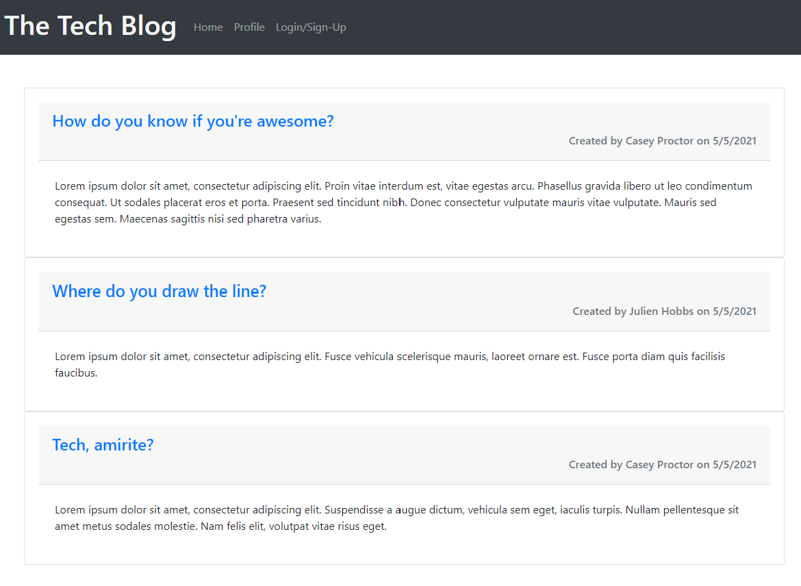
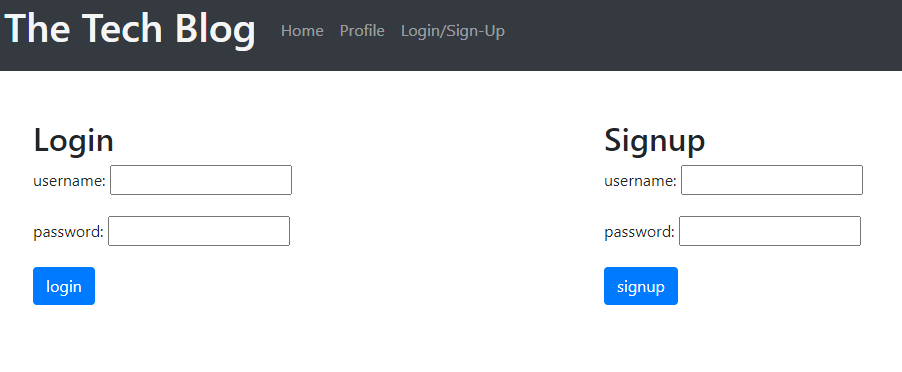
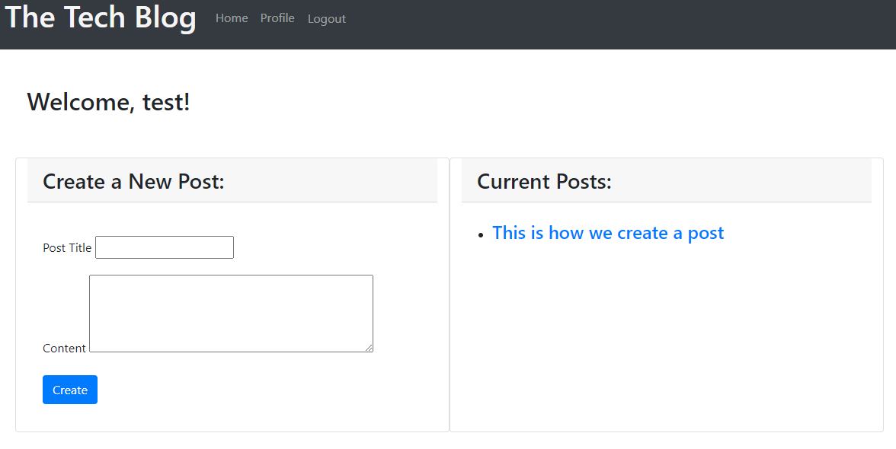
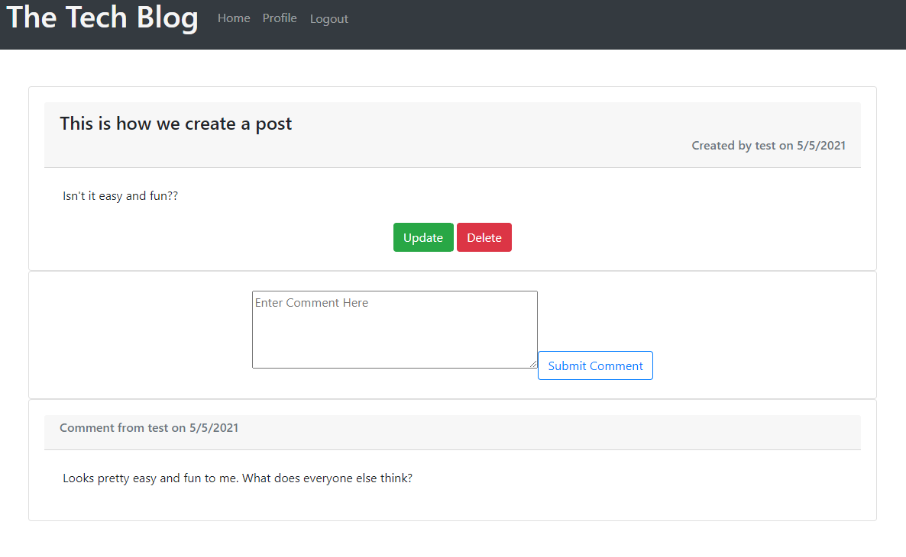

# Tech-Blog
A CMS-style blog site which allows users to publish articles, blog posts, as well as other thoughts and opinions. 

## Description
This application follows a Model-View-Controller paradigm, using handlebars, MySQL2, Sequelize, and Express to create a forum for the exchange of ideas. Once users have created and signed into their account they will be able to create posts, comment on other's posts, as well as update/delete their own creations. 

## Useage
The homepage has a list of existing posts. Create an account to access your profile page, create posts, comment on other posts, as well as update/delete previous posts. After 30 minutes of inactivity you will be logged out automatically. 

## Screenshots

